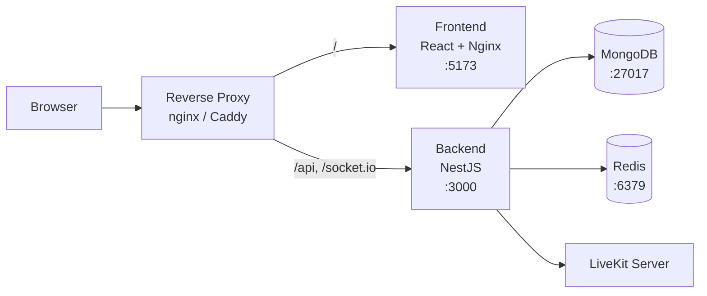

[](LICENSE.md)
[](https://github.com/krakenchat/kraken/actions/workflows/backend-tests.yml)
[](https://github.com/krakenchat/kraken/actions/workflows/frontend-tests.yml)
[](https://docs.krakenchat.app)

# Kraken

Self-hosted voice, video, and text chat — communication you own and control.

Kraken is an open-source communication platform that gives you full control over your data. Built with a modern stack — NestJS, React, MongoDB, and LiveKit — it provides real-time messaging, voice and video calls, and community management out of the box. Run it in your browser or as an Electron desktop app on Windows and Linux.

## Features

- **Messaging** — Real-time text channels with mentions, reactions, threads, file attachments, and read receipts
- **Voice & Video** — LiveKit-powered calls with screen sharing and replay buffer with clip trimming
- **Communities** — Servers with text and voice channels, private channels, DMs, and group DMs
- **Administration** — Role-based access control with granular permissions, moderation tools, storage quotas, and invite system
- **User Experience** — Profiles with avatars and banners, presence, friends list, push notifications, desktop app, and PWA support

## Architecture



| Layer | Technology |
|-------|-----------|
| Backend | [NestJS](https://nestjs.com/) (TypeScript) |
| Frontend | [React 19](https://react.dev/) + [Vite](https://vitejs.dev/) + [Material UI](https://mui.com/) |
| Database | [MongoDB](https://www.mongodb.com/) with [Prisma ORM](https://www.prisma.io/) |
| Real-time | [Socket.IO](https://socket.io/) with Redis adapter |
| Voice/Video | [LiveKit](https://livekit.io/) |
| State | [TanStack Query v5](https://tanstack.com/query/latest) |
| Auth | JWT with [Passport.js](https://www.passportjs.org/) |
| Desktop | [Electron](https://www.electronjs.org/) |

## Quickstart

Docker Compose setup. For Kubernetes deployment with Helm, see the [full docs](https://docs.krakenchat.app/installation/kubernetes/).

### 1. Pick your setup

<details open>
<summary><strong>With Caddy</strong> — automatic HTTPS</summary>

#### docker-compose.yml

```yaml
services:
  caddy:
    image: caddy:latest
    restart: unless-stopped
    ports:
      - "443:443"
      - "80:80"
    environment:
      HOST: ${HOST:?Set HOST in .env}
    volumes:
      - ./Caddyfile:/etc/caddy/Caddyfile:ro
      - caddy_data:/data
      - caddy_config:/config
    depends_on:
      - frontend
      - backend
      - livekit

  backend:
    image: ghcr.io/krakenchat/kraken-backend:latest
    restart: unless-stopped
    environment:
      MONGODB_URL: mongodb://mongo:27017/kraken?replicaSet=rs0&retryWrites=true&w=majority&directConnection=true
      REDIS_HOST: redis
      JWT_SECRET: ${JWT_SECRET:?Set JWT_SECRET in .env}
      JWT_REFRESH_SECRET: ${JWT_REFRESH_SECRET:?Set JWT_REFRESH_SECRET in .env}
      LIVEKIT_URL: wss://lk.${HOST:?Set HOST in .env}
      LIVEKIT_INTERNAL_URL: http://livekit:7880
      LIVEKIT_API_KEY: ${LIVEKIT_API_KEY:?Set LIVEKIT_API_KEY in .env}
      LIVEKIT_API_SECRET: ${LIVEKIT_API_SECRET:?Set LIVEKIT_API_SECRET in .env}
      REPLAY_SEGMENTS_PATH: /app/storage/replay-segments
      REPLAY_EGRESS_OUTPUT_PATH: /out
    volumes:
      - uploads:/app/backend/uploads
      - egress-data:/app/storage/replay-segments  # shared with livekit-egress
    depends_on:
      volume-init:
        condition: service_completed_successfully
      mongo:
        condition: service_healthy
      redis:
        condition: service_healthy
      livekit:
        condition: service_started

  frontend:
    image: ghcr.io/krakenchat/kraken-frontend:latest
    restart: unless-stopped
    environment:
      BACKEND_URL: http://backend:3000
    depends_on:
      - backend

  livekit:
    image: livekit/livekit-server:latest
    restart: unless-stopped
    environment:
      LIVEKIT_CONFIG: |
        port: 7880
        rtc:
          tcp_port: 7881
          udp_port: 7882
          use_external_ip: true
        redis:
          address: redis:6379
        keys:
          ${LIVEKIT_API_KEY}: ${LIVEKIT_API_SECRET}
        webhook:
          api_key: ${LIVEKIT_API_KEY}
          urls:
            - http://backend:3000/api/livekit/webhook
    ports:
      - "7881:7881"
      - "7882:7882/udp"

  volume-init:
    image: busybox
    volumes:
      - uploads:/uploads
      - egress-data:/out
    command: sh -c 'chown -R 1001:0 /uploads /out'
    restart: "no"

  livekit-egress:
    image: livekit/egress:latest
    restart: unless-stopped
    cap_add:
      - SYS_ADMIN
    environment:
      EGRESS_CONFIG_BODY: |
        api_key: ${LIVEKIT_API_KEY}
        api_secret: ${LIVEKIT_API_SECRET}
        ws_url: ws://livekit:7880
        redis:
          address: redis:6379
    volumes:
      - egress-data:/out
    depends_on:
      volume-init:
        condition: service_completed_successfully
      livekit:
        condition: service_started
      redis:
        condition: service_healthy

  livekit-ip-watcher:
    image: alpine:latest
    restart: unless-stopped
    command: sh /scripts/livekit-ip-watcher.sh
    environment:
      CHECK_INTERVAL: 300
      LIVEKIT_CONTAINER: livekit
    volumes:
      - ./scripts/livekit-ip-watcher.sh:/scripts/livekit-ip-watcher.sh:ro
      - /var/run/docker.sock:/var/run/docker.sock
    depends_on:
      livekit:
        condition: service_started

  mongo:
    image: mongo:7.0
    restart: unless-stopped
    command: ["--replSet", "rs0", "--bind_ip_all", "--port", "27017"]
    healthcheck:
      test: echo "try { rs.status() } catch (err) { rs.initiate({_id:'rs0',members:[{_id:0,host:'mongo:27017'}]}) }" | mongosh --port 27017 --quiet
      interval: 5s
      timeout: 30s
      start_period: 0s
      start_interval: 1s
      retries: 30
    volumes:
      - mongodata:/data/db
      - mongodb_config:/data/configdb

  redis:
    image: redis:latest
    restart: unless-stopped
    healthcheck:
      test: ["CMD", "redis-cli", "ping"]
      interval: 5s
      timeout: 10s
      retries: 10
    volumes:
      - redisdata:/data

volumes:
  mongodata:
  mongodb_config:
  redisdata:
  uploads:
  egress-data:
  caddy_data:
  caddy_config:
```

#### Caddyfile

Save this as `Caddyfile` next to your `docker-compose.yml`:

```
{$HOST:?Set HOST in .env} {
	reverse_proxy /api /api/* backend:3000
	reverse_proxy /socket.io/* backend:3000
	reverse_proxy frontend:5173
}

lk.{$HOST} {
	reverse_proxy livekit:7880
}
```

#### Download the IP watcher script

```bash
mkdir -p scripts
curl -fsSL https://raw.githubusercontent.com/krakenchat/kraken/main/scripts/livekit-ip-watcher.sh -o scripts/livekit-ip-watcher.sh
```

#### Port forwarding

| Port | Protocol | Service |
|------|----------|---------|
| 443 | TCP | HTTPS (frontend, backend, LiveKit signaling) |
| 80 | TCP | HTTP → HTTPS redirect |
| 7881 | TCP | LiveKit WebRTC (TCP) |
| 7882 | UDP | LiveKit WebRTC (UDP) |

</details>

<details>
<summary><strong>BYO reverse proxy</strong> — use your own (nginx, NPM, Traefik, etc.)</summary>

#### docker-compose.yml

```yaml
services:
  backend:
    image: ghcr.io/krakenchat/kraken-backend:latest
    restart: unless-stopped
    ports:
      - "3000:3000"
    environment:
      MONGODB_URL: mongodb://mongo:27017/kraken?replicaSet=rs0&retryWrites=true&w=majority&directConnection=true
      REDIS_HOST: redis
      JWT_SECRET: ${JWT_SECRET:?Set JWT_SECRET in .env}
      JWT_REFRESH_SECRET: ${JWT_REFRESH_SECRET:?Set JWT_REFRESH_SECRET in .env}
      LIVEKIT_URL: wss://lk.${HOST:?Set HOST in .env}
      LIVEKIT_INTERNAL_URL: http://livekit:7880
      LIVEKIT_API_KEY: ${LIVEKIT_API_KEY:?Set LIVEKIT_API_KEY in .env}
      LIVEKIT_API_SECRET: ${LIVEKIT_API_SECRET:?Set LIVEKIT_API_SECRET in .env}
      REPLAY_SEGMENTS_PATH: /app/storage/replay-segments
      REPLAY_EGRESS_OUTPUT_PATH: /out
    volumes:
      - uploads:/app/backend/uploads
      - egress-data:/app/storage/replay-segments  # shared with livekit-egress
    depends_on:
      volume-init:
        condition: service_completed_successfully
      mongo:
        condition: service_healthy
      redis:
        condition: service_healthy
      livekit:
        condition: service_started

  frontend:
    image: ghcr.io/krakenchat/kraken-frontend:latest
    restart: unless-stopped
    ports:
      - "5173:5173"
    environment:
      BACKEND_URL: http://backend:3000
    depends_on:
      - backend

  livekit:
    image: livekit/livekit-server:latest
    restart: unless-stopped
    environment:
      LIVEKIT_CONFIG: |
        port: 7880
        rtc:
          tcp_port: 7881
          udp_port: 7882
          use_external_ip: true
        redis:
          address: redis:6379
        keys:
          ${LIVEKIT_API_KEY}: ${LIVEKIT_API_SECRET}
        webhook:
          api_key: ${LIVEKIT_API_KEY}
          urls:
            - http://backend:3000/api/livekit/webhook
    ports:
      - "7880:7880"
      - "7881:7881"
      - "7882:7882/udp"


  livekit-egress:
    image: livekit/egress:latest
    restart: unless-stopped
    cap_add:
      - SYS_ADMIN
    environment:
      EGRESS_CONFIG_BODY: |
        api_key: ${LIVEKIT_API_KEY}
        api_secret: ${LIVEKIT_API_SECRET}
        ws_url: ws://livekit:7880
        redis:
          address: redis:6379
    volumes:
      - egress-data:/out
    depends_on:
      volume-init:
        condition: service_completed_successfully
      livekit:
        condition: service_started
      redis:
        condition: service_healthy

  livekit-ip-watcher:
    image: alpine:latest
    restart: unless-stopped
    command: sh /scripts/livekit-ip-watcher.sh
    environment:
      CHECK_INTERVAL: 300
      LIVEKIT_CONTAINER: livekit
    volumes:
      - ./scripts/livekit-ip-watcher.sh:/scripts/livekit-ip-watcher.sh:ro
      - /var/run/docker.sock:/var/run/docker.sock
    depends_on:
      livekit:
        condition: service_started

  mongo:
    image: mongo:7.0
    restart: unless-stopped
    command: ["--replSet", "rs0", "--bind_ip_all", "--port", "27017"]
    healthcheck:
      test: echo "try { rs.status() } catch (err) { rs.initiate({_id:'rs0',members:[{_id:0,host:'mongo:27017'}]}) }" | mongosh --port 27017 --quiet
      interval: 5s
      timeout: 30s
      start_period: 0s
      start_interval: 1s
      retries: 30
    volumes:
      - mongodata:/data/db
      - mongodb_config:/data/configdb

  redis:
    image: redis:latest
    restart: unless-stopped
    healthcheck:
      test: ["CMD", "redis-cli", "ping"]
      interval: 5s
      timeout: 10s
      retries: 10
    volumes:
      - redisdata:/data

volumes:
  mongodata:
  mongodb_config:
  redisdata:
  uploads:
  egress-data:
```

#### Reverse proxy routing

The frontend's built-in nginx already proxies `/api` and `/socket.io` to the backend internally. Your reverse proxy only needs to route by domain — no path splitting required:

| Domain | Destination | Notes |
|--------|-------------|-------|
| `your-domain.com` | `localhost:5173` | Frontend (handles `/api` and `/socket.io` internally) |
| `lk.your-domain.com` | `localhost:7880` | LiveKit signaling — ensure WebSocket upgrade headers are forwarded |

#### Download the IP watcher script

```bash
mkdir -p scripts
curl -fsSL https://raw.githubusercontent.com/krakenchat/kraken/main/scripts/livekit-ip-watcher.sh -o scripts/livekit-ip-watcher.sh
```

#### Port forwarding

| Port | Protocol | Service |
|------|----------|---------|
| 443 | TCP | Your reverse proxy |
| 7881 | TCP | LiveKit WebRTC (TCP) |
| 7882 | UDP | LiveKit WebRTC (UDP) |

</details>

### 2. Configure environment

Create a `.env` file next to your `docker-compose.yml`. Your domain needs two DNS records pointing to your server — `HOST` and `lk.HOST` (e.g. `kraken.example.com` and `lk.kraken.example.com`), or a wildcard `*.kraken.example.com`.

```env
HOST=kraken.example.com
JWT_SECRET=replace-with-a-long-random-string
JWT_REFRESH_SECRET=replace-with-a-different-long-random-string
LIVEKIT_API_KEY=replace-with-a-key-name
LIVEKIT_API_SECRET=replace-with-a-secret-at-least-32-characters
```

Generate secrets with:

```bash
openssl rand -base64 32
```

### 3. Start

```bash
docker compose up -d
```

### 4. Open Kraken

Visit `https://<your-domain>` and create your first account.

For more details, see the [full installation guide](https://docs.krakenchat.app/installation/docker-compose/).

## Development

For contributors working on Kraken itself — clone the repo and use the dev Compose file which mounts source code with hot reload:

```bash
git clone https://github.com/krakenchat/kraken.git
cd kraken
docker compose up
```

All development happens inside Docker containers — never run pnpm/npm/node directly on the host.

```bash
# Run backend tests
docker compose run --rm backend pnpm run test

# Run frontend tests
docker compose run --rm frontend pnpm run test

# Lint
docker compose run --rm backend pnpm run lint

# Push database schema
docker compose run --rm backend pnpm run prisma
```

See [CONTRIBUTING.md](./CONTRIBUTING.md) and the [developer docs](https://docs.krakenchat.app) for more.

## Deployment

- **Docker Compose** — The [installation guide](https://docs.krakenchat.app/installation/docker-compose/) covers everything from first launch to production with reverse proxy, TLS, and backups.

- **Kubernetes** — Deploy with the official Helm chart:
  ```bash
  helm install kraken oci://ghcr.io/krakenchat/charts/kraken
  ```
  See the [Helm chart README](./helm/kraken/README.md) and [Kubernetes guide](https://docs.krakenchat.app/installation/kubernetes/).

- **Desktop app** — Electron builds for Windows and Linux are available from the [desktop app page](https://docs.krakenchat.app/installation/desktop-app/).

- **Docker images** — `ghcr.io/krakenchat/kraken-backend` and `ghcr.io/krakenchat/kraken-frontend`

## Documentation

- Full docs: [docs.krakenchat.app](https://docs.krakenchat.app)
- API docs: Swagger UI at `/api` when running locally

## Contributing

See [CONTRIBUTING.md](./CONTRIBUTING.md) for guidelines on bug reports, feature requests, and code contributions.

## Security

To report a vulnerability, see [SECURITY.md](./SECURITY.md).

## License

Kraken Chat is **dual-licensed**:

- **AGPLv3** (default) — free for everyone, including commercial use, as long as you comply with AGPL terms (see [LICENSE](./LICENSE.md)).
- **Commercial License** — available for those who want to keep modifications proprietary or avoid AGPL source-sharing obligations (see [LICENSE_COM](./LICENSE_COM.md) and [LICENSE-FAQ.md](./LICENSE-FAQ.md)).

Contact us for commercial licensing — licensing {at} krakenchat [dot] app
