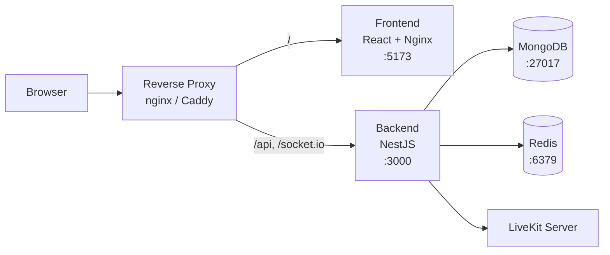

# Docker Compose

Deploy Kraken with Docker Compose — from first launch to production.

## Prerequisites

- **[Docker](https://docs.docker.com/get-docker/)** (v20+) and **Docker Compose** (v2+)
- A domain name pointing to your server (e.g. `kraken.example.com`)

## Choose your setup

Three options depending on your existing infrastructure:

=== "With Caddy"

    Includes Caddy as a reverse proxy with automatic HTTPS via Let's Encrypt, plus a bundled LiveKit server. Everything you need in one Compose file.

=== "Batteries included"

    Bundles a LiveKit server for voice and video, but no reverse proxy — use this if you already run one (nginx, NPM, Traefik, etc.).

=== "Bring your own LiveKit"

    No reverse proxy, no LiveKit — use this if you already run both. Voice/video are disabled until you add your LiveKit credentials.

!!! tip "Mixing and matching"
    These are starting points. The core services (backend, frontend, mongo, redis) are the same across all three. The differences are whether Caddy and/or LiveKit are included. You can add Caddy from the first tab to either of the other setups, or remove LiveKit from the first tab if you bring your own.

## Install

### 1. Create the Compose file

```bash
mkdir kraken && cd kraken
```

Copy the Compose file for your chosen setup:

=== "With Caddy"

    ```yaml title="docker-compose.yml"
    services:
      caddy:
        image: caddy:latest
        restart: unless-stopped
        ports:
          - "443:443"
          - "80:80"
        volumes:
          - ./Caddyfile:/etc/caddy/Caddyfile:ro
          - caddy_data:/data
          - caddy_config:/config
        depends_on:
          - frontend
          - backend
          - livekit

      backend:
        image: ghcr.io/krakenchat/kraken-backend:latest
        restart: unless-stopped
        environment:
          MONGODB_URL: mongodb://mongo:27017/kraken?replicaSet=rs0&retryWrites=true&w=majority&directConnection=true
          REDIS_HOST: redis
          JWT_SECRET: ${JWT_SECRET:?Set JWT_SECRET in .env}
          JWT_REFRESH_SECRET: ${JWT_REFRESH_SECRET:?Set JWT_REFRESH_SECRET in .env}
          LIVEKIT_URL: wss://lk.${HOST:?Set HOST in .env}
          LIVEKIT_INTERNAL_URL: http://livekit:7880
          LIVEKIT_API_KEY: ${LIVEKIT_API_KEY:?Set LIVEKIT_API_KEY in .env}
          LIVEKIT_API_SECRET: ${LIVEKIT_API_SECRET:?Set LIVEKIT_API_SECRET in .env}
        depends_on:
          mongo:
            condition: service_healthy
          redis:
            condition: service_healthy
          livekit:
            condition: service_started

      frontend:
        image: ghcr.io/krakenchat/kraken-frontend:latest
        restart: unless-stopped
        environment:
          BACKEND_URL: http://backend:3000

      livekit:
        image: livekit/livekit-server:latest
        restart: unless-stopped
        environment:
          LIVEKIT_CONFIG: |
            port: 7880
            rtc:
              tcp_port: 7881
              udp_mux_port: 7882
              use_external_ip: true
            keys:
              ${LIVEKIT_API_KEY}: ${LIVEKIT_API_SECRET}
            webhook:
              api_key: ${LIVEKIT_API_KEY}
              urls:
                - http://backend:3000/api/livekit/webhook
        ports:
          - "7881:7881"
          - "7882:7882/udp"

      livekit-ip-watcher:
        image: alpine:latest
        restart: unless-stopped
        command: >
          sh -c 'apk add --no-cache curl &&
          curl -fsSL https://raw.githubusercontent.com/krakenchat/kraken/main/scripts/livekit-ip-watcher.sh | sh'
        environment:
          CHECK_INTERVAL: 300
          LIVEKIT_CONTAINER: livekit
        volumes:
          - /var/run/docker.sock:/var/run/docker.sock
        depends_on:
          livekit:
            condition: service_started

      mongo:
        image: mongo:7.0
        restart: unless-stopped
        command: ["--replSet", "rs0", "--bind_ip_all", "--port", "27017"]
        healthcheck:
          test: echo "try { rs.status() } catch (err) { rs.initiate({_id:'rs0',members:[{_id:0,host:'mongo:27017'}]}) }" | mongosh --port 27017 --quiet
          interval: 5s
          timeout: 30s
          start_period: 0s
          start_interval: 1s
          retries: 30
        volumes:
          - mongodata:/data/db
          - mongodb_config:/data/configdb

      redis:
        image: redis:latest
        restart: unless-stopped
        healthcheck:
          test: ["CMD", "redis-cli", "ping"]
          interval: 5s
          timeout: 10s
          retries: 10
        volumes:
          - redisdata:/data

    volumes:
      mongodata:
      mongodb_config:
      redisdata:
      caddy_data:
      caddy_config:
    ```

    **You also need a `Caddyfile`** next to your `docker-compose.yml`:

    ```title="Caddyfile"
    {$HOST:?Set HOST in .env} {
    	reverse_proxy /api /api/* backend:3000
    	reverse_proxy /socket.io/* backend:3000
    	reverse_proxy frontend:5173
    }

    lk.{$HOST} {
    	reverse_proxy livekit:7880
    }
    ```

    **What's in this setup:**

    - **Caddy** handles TLS automatically via Let's Encrypt — routes `/api/*` and `/socket.io/*` to the backend, everything else to the frontend, and `lk.` subdomain to LiveKit signaling
    - **LiveKit** uses `udp_mux_port` to multiplex all WebRTC UDP traffic through a single port (no user cap, no port range to forward)
    - **`use_external_ip: true`** — LiveKit discovers its public IP via STUN
    - **IP watcher** — monitors your public IP and restarts LiveKit if it changes (important for dynamic IPs)
    - **`LIVEKIT_INTERNAL_URL`** — the backend uses this Docker-internal address for server-to-server API calls, while `LIVEKIT_URL` is the browser-facing address returned to clients
    - The LiveKit API key/secret are shared between the backend and LiveKit — the backend uses them to generate tokens and LiveKit uses them to sign webhook payloads

=== "Batteries included"

    ```yaml title="docker-compose.yml"
    services:
      backend:
        image: ghcr.io/krakenchat/kraken-backend:latest
        restart: unless-stopped
        ports:
          - "3000:3000"
        environment:
          MONGODB_URL: mongodb://mongo:27017/kraken?replicaSet=rs0&retryWrites=true&w=majority&directConnection=true
          REDIS_HOST: redis
          JWT_SECRET: ${JWT_SECRET:?Set JWT_SECRET in .env}
          JWT_REFRESH_SECRET: ${JWT_REFRESH_SECRET:?Set JWT_REFRESH_SECRET in .env}
          LIVEKIT_URL: wss://lk.${HOST:?Set HOST in .env}
          LIVEKIT_INTERNAL_URL: http://livekit:7880
          LIVEKIT_API_KEY: ${LIVEKIT_API_KEY:?Set LIVEKIT_API_KEY in .env}
          LIVEKIT_API_SECRET: ${LIVEKIT_API_SECRET:?Set LIVEKIT_API_SECRET in .env}
        depends_on:
          mongo:
            condition: service_healthy
          redis:
            condition: service_healthy
          livekit:
            condition: service_started

      frontend:
        image: ghcr.io/krakenchat/kraken-frontend:latest
        restart: unless-stopped
        ports:
          - "5173:5173"
        environment:
          BACKEND_URL: http://backend:3000
        depends_on:
          - backend

      livekit:
        image: livekit/livekit-server:latest
        restart: unless-stopped
        environment:
          LIVEKIT_CONFIG: |
            port: 7880
            rtc:
              tcp_port: 7881
              udp_mux_port: 7882
              use_external_ip: true
            keys:
              ${LIVEKIT_API_KEY}: ${LIVEKIT_API_SECRET}
            webhook:
              api_key: ${LIVEKIT_API_KEY}
              urls:
                - http://backend:3000/api/livekit/webhook
        ports:
          - "7880:7880"
          - "7881:7881"
          - "7882:7882/udp"

      livekit-ip-watcher:
        image: alpine:latest
        restart: unless-stopped
        command: >
          sh -c 'apk add --no-cache curl &&
          curl -fsSL https://raw.githubusercontent.com/krakenchat/kraken/main/scripts/livekit-ip-watcher.sh | sh'
        environment:
          CHECK_INTERVAL: 300
          LIVEKIT_CONTAINER: livekit
        volumes:
          - /var/run/docker.sock:/var/run/docker.sock
        depends_on:
          livekit:
            condition: service_started

      mongo:
        image: mongo:7.0
        restart: unless-stopped
        command: ["--replSet", "rs0", "--bind_ip_all", "--port", "27017"]
        healthcheck:
          test: echo "try { rs.status() } catch (err) { rs.initiate({_id:'rs0',members:[{_id:0,host:'mongo:27017'}]}) }" | mongosh --port 27017 --quiet
          interval: 5s
          timeout: 30s
          start_period: 0s
          start_interval: 1s
          retries: 30
        volumes:
          - mongodata:/data/db
          - mongodb_config:/data/configdb

      redis:
        image: redis:latest
        restart: unless-stopped
        healthcheck:
          test: ["CMD", "redis-cli", "ping"]
          interval: 5s
          timeout: 10s
          retries: 10
        volumes:
          - redisdata:/data

    volumes:
      mongodata:
      mongodb_config:
      redisdata:
    ```

    **What's in the LiveKit config:**

    - `udp_mux_port: 7882` — multiplexes all WebRTC UDP traffic through a single port (no user cap, no port range to forward)
    - `use_external_ip: true` — LiveKit discovers its public IP via STUN
    - `keys` — the API key/secret pair must match what the backend uses, and the **secret must be at least 32 characters** or LiveKit will refuse to start
    - `webhook` — pre-configured to send voice presence events back to the backend (requires `api_key` to sign payloads)
    - `LIVEKIT_INTERNAL_URL` — the backend uses this Docker-internal address for server-to-server API calls, while `LIVEKIT_URL` is the browser-facing address returned to clients
    - **IP watcher** — monitors your public IP and restarts LiveKit if it changes (important for dynamic IPs)

    **You need to configure your reverse proxy** to route traffic to these services. See [Reverse proxy and HTTPS](#reverse-proxy-and-https) below.

=== "Bring your own LiveKit"

    ```yaml title="docker-compose.yml"
    services:
      backend:
        image: ghcr.io/krakenchat/kraken-backend:latest
        restart: unless-stopped
        ports:
          - "3000:3000"
        environment:
          MONGODB_URL: mongodb://mongo:27017/kraken?replicaSet=rs0&retryWrites=true&w=majority&directConnection=true
          REDIS_HOST: redis
          JWT_SECRET: ${JWT_SECRET:?Set JWT_SECRET in .env}
          JWT_REFRESH_SECRET: ${JWT_REFRESH_SECRET:?Set JWT_REFRESH_SECRET in .env}
          # Uncomment and fill in to enable voice/video:
          # LIVEKIT_URL: ${LIVEKIT_URL:-}
          # LIVEKIT_API_KEY: ${LIVEKIT_API_KEY:-}
          # LIVEKIT_API_SECRET: ${LIVEKIT_API_SECRET:-}
        depends_on:
          mongo:
            condition: service_healthy
          redis:
            condition: service_healthy

      frontend:
        image: ghcr.io/krakenchat/kraken-frontend:latest
        restart: unless-stopped
        ports:
          - "5173:5173"
        environment:
          BACKEND_URL: http://backend:3000
        depends_on:
          - backend

      mongo:
        image: mongo:7.0
        restart: unless-stopped
        command: ["--replSet", "rs0", "--bind_ip_all", "--port", "27017"]
        healthcheck:
          test: echo "try { rs.status() } catch (err) { rs.initiate({_id:'rs0',members:[{_id:0,host:'mongo:27017'}]}) }" | mongosh --port 27017 --quiet
          interval: 5s
          timeout: 30s
          start_period: 0s
          start_interval: 1s
          retries: 30
        volumes:
          - mongodata:/data/db
          - mongodb_config:/data/configdb

      redis:
        image: redis:latest
        restart: unless-stopped
        healthcheck:
          test: ["CMD", "redis-cli", "ping"]
          interval: 5s
          timeout: 10s
          retries: 10
        volumes:
          - redisdata:/data

    volumes:
      mongodata:
      mongodb_config:
      redisdata:
    ```

    To enable voice/video later, uncomment the `LIVEKIT_*` lines and add your credentials to `.env`. See [Connecting your LiveKit server](#connecting-your-livekit-server) below.

### 2. Configure environment

Create a `.env` file next to your `docker-compose.yml`:

=== "With Caddy"

    Your domain needs two DNS records pointing to your server — `HOST` and `lk.HOST` (e.g. `kraken.example.com` and `lk.kraken.example.com`), or a wildcard `*.kraken.example.com`.

    ```env title=".env"
    HOST=kraken.example.com
    JWT_SECRET=replace-with-a-long-random-string
    JWT_REFRESH_SECRET=replace-with-a-different-long-random-string
    LIVEKIT_API_KEY=replace-with-a-key-name
    LIVEKIT_API_SECRET=replace-with-a-secret-at-least-32-characters
    ```

=== "Batteries included"

    Your domain needs two DNS records pointing to your server — `HOST` and `lk.HOST` (e.g. `kraken.example.com` and `lk.kraken.example.com`), or a wildcard `*.kraken.example.com`.

    ```env title=".env"
    HOST=kraken.example.com
    JWT_SECRET=replace-with-a-long-random-string
    JWT_REFRESH_SECRET=replace-with-a-different-long-random-string
    LIVEKIT_API_KEY=replace-with-a-key-name
    LIVEKIT_API_SECRET=replace-with-a-secret-at-least-32-characters
    ```

=== "Bring your own LiveKit"

    ```env title=".env"
    JWT_SECRET=replace-with-a-long-random-string
    JWT_REFRESH_SECRET=replace-with-a-different-long-random-string

    # Uncomment to enable voice/video:
    # LIVEKIT_URL=wss://your-livekit-server.com
    # LIVEKIT_API_KEY=your-api-key
    # LIVEKIT_API_SECRET=your-api-secret
    ```

Generate strong secrets with:

```bash
openssl rand -base64 32
```

!!! warning "Security"
    Never use the default secrets in production. Generate unique values for each secret.

!!! tip "Push notifications"
    To enable push notifications, add `VAPID_PUBLIC_KEY`, `VAPID_PRIVATE_KEY`, and `VAPID_SUBJECT` to your `.env`. See the [Configuration](configuration.md#push-notifications-vapid) page for how to generate VAPID keys.

See the [Configuration](configuration.md) page for the full environment variable reference.

### 3. Start all services

```bash
docker compose up -d
```

=== "With Caddy"

    Caddy will automatically obtain TLS certificates from Let's Encrypt for your domain.

    | Service | Description | URL |
    |---------|------------|-----|
    | **Caddy** | Reverse proxy with automatic HTTPS | `https://your-domain.com` |
    | **Frontend** | React app (behind Caddy) | — |
    | **Backend** | NestJS API (behind Caddy) | — |
    | **LiveKit** | Voice/video media server | `wss://lk.your-domain.com` |
    | **MongoDB** | Database (replica set) | internal only |
    | **Redis** | Cache and pub/sub | internal only |

    **Port forwarding** — forward these on your router:

    | Port | Protocol | Service |
    |------|----------|---------|
    | 443 | TCP | HTTPS (frontend, backend, LiveKit signaling) |
    | 80 | TCP | HTTP → HTTPS redirect |
    | 7881 | TCP | LiveKit WebRTC (TCP) |
    | 7882 | UDP | LiveKit WebRTC (UDP) |

=== "Batteries included"

    | Service | Description | URL |
    |---------|------------|-----|
    | **Frontend** | Nginx serving the React app | `http://localhost:5173` |
    | **Backend** | NestJS API | `http://localhost:3000` |
    | **LiveKit** | Voice/video media server | `ws://localhost:7880` |
    | **MongoDB** | Database (replica set) | internal only |
    | **Redis** | Cache and pub/sub | internal only |

    **Port forwarding** — forward these on your router:

    | Port | Protocol | Service |
    |------|----------|---------|
    | 443 | TCP | Your reverse proxy |
    | 5173 | TCP | Frontend (or proxy to it) |
    | 3000 | TCP | Backend API (or proxy to it) |
    | 7880 | TCP | LiveKit signaling (or proxy to it) |
    | 7881 | TCP | LiveKit WebRTC (TCP) |
    | 7882 | UDP | LiveKit WebRTC (UDP) |

    The frontend's built-in nginx already proxies `/api` and `/socket.io` to the backend internally. Your reverse proxy only needs to route by domain:

    | Domain | Destination | Notes |
    |--------|-------------|-------|
    | `your-domain.com` | `localhost:5173` | Frontend (handles `/api` and `/socket.io` internally) |
    | `lk.your-domain.com` | `localhost:7880` | LiveKit signaling — ensure WebSocket upgrade headers are forwarded |

=== "Bring your own LiveKit"

    | Service | Description | URL |
    |---------|------------|-----|
    | **Frontend** | Nginx serving the React app | `http://localhost:5173` |
    | **Backend** | NestJS API | `http://localhost:3000` |
    | **MongoDB** | Database (replica set) | internal only |
    | **Redis** | Cache and pub/sub | internal only |

### 4. Open Kraken

Visit your domain (or `http://localhost:5173` without Caddy) in your browser. You're ready to [create your first account](first-run.md).

## Stopping and restarting

```bash
# Stop all services
docker compose down

# Start again (data is persisted in Docker volumes)
docker compose up -d

# Full reset (removes all data)
docker compose down -v
```

## Connecting your LiveKit server

If you chose the "Bring your own LiveKit" setup, follow these steps to enable voice and video.

### LiveKit Cloud

1. **Sign up** at [LiveKit Cloud](https://cloud.livekit.io/) and create a project
2. **Add credentials** to your `.env`:
    ```env
    LIVEKIT_URL=wss://your-project.livekit.cloud
    LIVEKIT_API_KEY=your-api-key
    LIVEKIT_API_SECRET=your-api-secret
    ```
3. **Uncomment** the `LIVEKIT_*` lines in `docker-compose.yml`
4. **Configure webhooks** in the LiveKit Cloud dashboard — set the URL to `https://your-domain.com/api/livekit/webhook`
5. **Restart**: `docker compose down && docker compose up -d`

!!! note "Replay capture not yet supported with LiveKit Cloud"
    The replay/clip capture feature requires LiveKit egress and Kraken to share a filesystem for HLS segment access. LiveKit Cloud writes egress output to cloud storage (S3/GCS/Azure Blob), which Kraken can't read from yet. Voice and video calls work normally — only replay capture is affected. See [#227](https://github.com/krakenchat/kraken/issues/227) for progress on cloud storage support.

### Self-hosted LiveKit

1. **Add credentials** to your `.env`:
    ```env
    LIVEKIT_URL=wss://your-livekit-server.com
    LIVEKIT_API_KEY=your-api-key
    LIVEKIT_API_SECRET=your-api-secret
    ```
2. **Uncomment** the `LIVEKIT_*` lines in `docker-compose.yml`
3. **Configure webhooks** on your LiveKit server to send events to `https://your-domain.com/api/livekit/webhook`
4. **Restart**: `docker compose down && docker compose up -d`

!!! tip "When browser and backend URLs differ"
    If the backend can't reach LiveKit at the same URL the browser uses (e.g., different networks), set `LIVEKIT_INTERNAL_URL` to the backend-reachable address. The backend uses this for server-to-server API calls while `LIVEKIT_URL` is returned to browsers. See the [Configuration](configuration.md) page for details.

## Going to production

### Architecture overview



!!! danger "Change all default secrets"
    Generate unique random values for **every** secret. Never commit `.env` files to version control.

### Reverse proxy and HTTPS

If you chose the "With Caddy" setup, this is already handled. For the other setups, place a reverse proxy in front of Kraken to handle TLS termination:

- Proxy `your-domain.com` to the frontend (port 5173) — the frontend's nginx handles `/api` and `/socket.io` routing to the backend internally
- Proxy `lk.your-domain.com` to LiveKit signaling (port 7880)
- Ensure WebSocket upgrade headers are forwarded for LiveKit

### Data persistence

Docker Compose uses named volumes for MongoDB and Redis data. These persist across container restarts.

- **Backup MongoDB** regularly: `docker compose exec mongo mongodump --out /backup`
- **Monitor disk usage** — MongoDB and uploads can grow over time

### Resource limits

For production, consider adding resource limits in a `docker-compose.override.yml`:

```yaml
services:
  backend:
    deploy:
      resources:
        limits:
          memory: 1G
  frontend:
    deploy:
      resources:
        limits:
          memory: 512M
```

### Replay capture (LiveKit egress)

The replay/clip capture feature requires LiveKit egress to write HLS segments to a location that the Kraken backend can also read from. Both services need access to the same storage path.

Mount a shared volume into both the LiveKit egress container and the Kraken backend:

```yaml
services:
  backend:
    volumes:
      - egress-data:/out
    environment:
      REPLAY_EGRESS_OUTPUT_PATH: /out
      REPLAY_SEGMENTS_PATH: /out

  # Your LiveKit egress service must also mount egress-data:/out

volumes:
  egress-data:
```

!!! note "LiveKit Cloud"
    LiveKit Cloud writes egress output to cloud storage (S3/GCS/Azure Blob), which Kraken can't read from yet. Replay capture is not available with LiveKit Cloud until cloud storage support is added. See [#227](https://github.com/krakenchat/kraken/issues/227) for progress.

### Dynamic IP support

If your server has a dynamic public IP (common with residential ISPs), voice and video will break when the IP changes. LiveKit resolves its external IP once at startup via STUN and bakes it into WebRTC ICE candidates — there is no periodic re-resolution.

The "With Caddy" and "Batteries included" setups already include the `livekit-ip-watcher` service, which monitors your public IP and restarts LiveKit when it changes. No additional setup is needed.

If you're using the "Bring your own LiveKit" setup with a self-hosted LiveKit server, you'll need to handle IP changes on your LiveKit server separately.

!!! warning "Docker socket security"
    The IP watcher mounts `/var/run/docker.sock` to restart the LiveKit container. This grants it full Docker API access. Only use this on hosts where you trust all running containers.

## Updating

```bash
docker compose pull
docker compose up -d
```

The database schema is automatically updated on container startup.

## Troubleshooting

### "Replica set not initialized"

The Docker Compose setup automatically configures the MongoDB replica set. If you see this error, restart the containers:

```bash
docker compose down && docker compose up -d
```

### "Port already in use"

Check what's using the port and stop it:

```bash
lsof -i :3000  # Backend
lsof -i :5173  # Frontend
lsof -i :7880  # LiveKit
```

### LiveKit exits immediately

Check the logs:

```bash
docker compose logs livekit
```

Common causes:

- **"secret is too short"** — The API secret in the `LIVEKIT_CONFIG` keys section and in the backend's `LIVEKIT_API_SECRET` must be at least 32 characters. Both values must match.
- **"api_key is required to use webhooks"** — The `webhook` section in `LIVEKIT_CONFIG` needs an `api_key` field matching one of the keys defined in the `keys` section.

### Containers won't start

Try pulling fresh images and recreating:

```bash
docker compose down -v
docker compose pull
docker compose up -d
```

## Next steps

- [Configuration](configuration.md) — Full environment variable reference
- [First Run](first-run.md) — Create your first user, community, and channels
- [Kubernetes](kubernetes.md) — Deploy to a Kubernetes cluster
