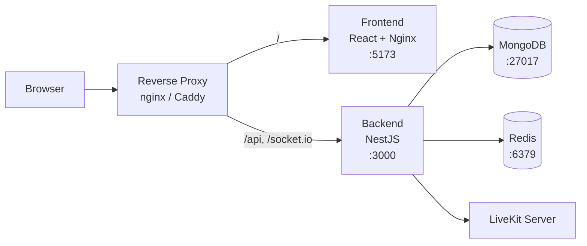

# Docker Compose

Deploy Kraken with Docker Compose — from first launch to production.

## Prerequisites

- **[Docker](https://docs.docker.com/get-docker/)** (v20+) and **Docker Compose** (v2+)

## Choose your LiveKit setup

Kraken uses [LiveKit](https://livekit.io/) for voice and video. Pick the option that fits your situation:

=== "Batteries included (recommended)"

    Bundles a local LiveKit server so voice and video work out of the box — nothing else to install.

=== "Bring your own LiveKit"

    Use this if you already run LiveKit (self-hosted or [LiveKit Cloud](https://cloud.livekit.io/)). Voice/video are disabled until you add your credentials.

## Install

### 1. Create the Compose file

```bash
mkdir kraken && cd kraken
```

Copy the Compose file for your chosen setup:

=== "Batteries included (recommended)"

    ```yaml title="docker-compose.yml"
    services:
      backend:
        image: ghcr.io/krakenchat/kraken-backend:latest
        ports:
          - "3000:3000"
        environment:
          MONGODB_URL: mongodb://mongo:27017/kraken?replicaSet=rs0&retryWrites=true&w=majority&directConnection=true
          REDIS_HOST: redis
          JWT_SECRET: ${JWT_SECRET:?Set JWT_SECRET in .env}
          JWT_REFRESH_SECRET: ${JWT_REFRESH_SECRET:?Set JWT_REFRESH_SECRET in .env}
          LIVEKIT_URL: ws://localhost:7880
          LIVEKIT_INTERNAL_URL: http://livekit:7880
          LIVEKIT_API_KEY: devkey
          LIVEKIT_API_SECRET: secret-that-is-at-least-32-characters-long
        depends_on:
          mongo:
            condition: service_healthy
          redis:
            condition: service_healthy
          livekit:
            condition: service_started

      frontend:
        image: ghcr.io/krakenchat/kraken-frontend:latest
        ports:
          - "5173:5173"
        environment:
          BACKEND_URL: http://backend:3000
        depends_on:
          - backend

      livekit:
        image: livekit/livekit-server:latest
        environment:
          LIVEKIT_CONFIG: |
            port: 7880
            rtc:
              tcp_port: 7881
              port_range_start: 50000
              port_range_end: 50060
              use_external_ip: false
              node_ip: 127.0.0.1
            keys:
              devkey: secret-that-is-at-least-32-characters-long
            webhook:
              api_key: devkey
              urls:
                - http://backend:3000/api/livekit/webhook
        ports:
          - "7880:7880"
          - "7881:7881"
          - "50000-50060:50000-50060/udp"

      mongo:
        image: mongo:7.0
        command: ["--replSet", "rs0", "--bind_ip_all", "--port", "27017"]
        ports:
          - "27017:27017"
        healthcheck:
          test: echo "try { rs.status() } catch (err) { rs.initiate({_id:'rs0',members:[{_id:0,host:'mongo:27017'}]}) }" | mongosh --port 27017 --quiet
          interval: 5s
          timeout: 30s
          start_period: 0s
          start_interval: 1s
          retries: 30
        volumes:
          - mongodata:/data/db
          - mongodb_config:/data/configdb

      redis:
        image: redis:latest
        ports:
          - "6379:6379"
        healthcheck:
          test: ["CMD", "redis-cli", "ping"]
          interval: 5s
          timeout: 10s
          retries: 10
        volumes:
          - redisdata:/data

    volumes:
      mongodata:
      mongodb_config:
      redisdata:
    ```

    **What's in the LiveKit config:**

    - `node_ip: 127.0.0.1` — tells WebRTC clients to connect via localhost (required for Docker port forwarding)
    - `use_external_ip: false` — disables STUN-based IP discovery (not needed locally)
    - `keys` — the API key/secret pair must match what the backend uses, and the **secret must be at least 32 characters** or LiveKit will refuse to start
    - `webhook` — pre-configured to send voice presence events back to the backend (requires `api_key` to sign payloads)
    - `LIVEKIT_INTERNAL_URL` — the backend uses this Docker-internal address for server-to-server API calls (room management, muting), while `LIVEKIT_URL` is the browser-facing address returned to clients

=== "Bring your own LiveKit"

    ```yaml title="docker-compose.yml"
    services:
      backend:
        image: ghcr.io/krakenchat/kraken-backend:latest
        ports:
          - "3000:3000"
        environment:
          MONGODB_URL: mongodb://mongo:27017/kraken?replicaSet=rs0&retryWrites=true&w=majority&directConnection=true
          REDIS_HOST: redis
          JWT_SECRET: ${JWT_SECRET:?Set JWT_SECRET in .env}
          JWT_REFRESH_SECRET: ${JWT_REFRESH_SECRET:?Set JWT_REFRESH_SECRET in .env}
          # Uncomment and fill in to enable voice/video:
          # LIVEKIT_URL: ${LIVEKIT_URL:-}
          # LIVEKIT_API_KEY: ${LIVEKIT_API_KEY:-}
          # LIVEKIT_API_SECRET: ${LIVEKIT_API_SECRET:-}
        depends_on:
          mongo:
            condition: service_healthy
          redis:
            condition: service_healthy

      frontend:
        image: ghcr.io/krakenchat/kraken-frontend:latest
        ports:
          - "5173:5173"
        environment:
          BACKEND_URL: http://backend:3000
        depends_on:
          - backend

      mongo:
        image: mongo:7.0
        command: ["--replSet", "rs0", "--bind_ip_all", "--port", "27017"]
        ports:
          - "27017:27017"
        healthcheck:
          test: echo "try { rs.status() } catch (err) { rs.initiate({_id:'rs0',members:[{_id:0,host:'mongo:27017'}]}) }" | mongosh --port 27017 --quiet
          interval: 5s
          timeout: 30s
          start_period: 0s
          start_interval: 1s
          retries: 30
        volumes:
          - mongodata:/data/db
          - mongodb_config:/data/configdb

      redis:
        image: redis:latest
        ports:
          - "6379:6379"
        healthcheck:
          test: ["CMD", "redis-cli", "ping"]
          interval: 5s
          timeout: 10s
          retries: 10
        volumes:
          - redisdata:/data

    volumes:
      mongodata:
      mongodb_config:
      redisdata:
    ```

    To enable voice/video later, uncomment the `LIVEKIT_*` lines and add your credentials to `.env`. See [Connecting your LiveKit server](#connecting-your-livekit-server) below.

### 2. Configure environment

Create a `.env` file next to your `docker-compose.yml`:

=== "Batteries included (recommended)"

    ```env title=".env"
    JWT_SECRET=replace-with-a-long-random-string
    JWT_REFRESH_SECRET=replace-with-a-different-long-random-string
    ```

=== "Bring your own LiveKit"

    ```env title=".env"
    JWT_SECRET=replace-with-a-long-random-string
    JWT_REFRESH_SECRET=replace-with-a-different-long-random-string

    # Uncomment to enable voice/video:
    # LIVEKIT_URL=wss://your-livekit-server.com
    # LIVEKIT_API_KEY=your-api-key
    # LIVEKIT_API_SECRET=your-api-secret
    ```

Generate strong JWT secrets with:

```bash
openssl rand -base64 32
```

!!! warning "Security"
    Never use the default secrets in production. Generate unique values for each secret.

See the [Configuration](configuration.md) page for the full environment variable reference.

### 3. Start all services

```bash
docker compose up
```

=== "Batteries included (recommended)"

    | Service | Description | URL |
    |---------|------------|-----|
    | **Frontend** | Nginx serving the React app | [http://localhost:5173](http://localhost:5173) |
    | **Backend** | NestJS API | [http://localhost:3000](http://localhost:3000) |
    | **LiveKit** | Voice/video media server | `ws://localhost:7880` |
    | **MongoDB** | Database (replica set) | `localhost:27017` |
    | **Redis** | Cache and pub/sub | `localhost:6379` |

=== "Bring your own LiveKit"

    | Service | Description | URL |
    |---------|------------|-----|
    | **Frontend** | Nginx serving the React app | [http://localhost:5173](http://localhost:5173) |
    | **Backend** | NestJS API | [http://localhost:3000](http://localhost:3000) |
    | **MongoDB** | Database (replica set) | `localhost:27017` |
    | **Redis** | Cache and pub/sub | `localhost:6379` |

### 4. Initialize the database

On first run, push the Prisma schema to MongoDB:

```bash
docker compose exec backend npx prisma db push --schema=prisma/schema.prisma
```

### 5. Open Kraken

Visit [http://localhost:5173](http://localhost:5173) in your browser. You're ready to [create your first account](first-run.md).

## Stopping and restarting

```bash
# Stop all services
docker compose down

# Start again (data is persisted in Docker volumes)
docker compose up

# Full reset (removes all data)
docker compose down -v
```

## Connecting your LiveKit server

If you chose the "Bring your own LiveKit" setup, follow these steps to enable voice and video.

### LiveKit Cloud

1. **Sign up** at [LiveKit Cloud](https://cloud.livekit.io/) and create a project
2. **Add credentials** to your `.env`:
    ```env
    LIVEKIT_URL=wss://your-project.livekit.cloud
    LIVEKIT_API_KEY=your-api-key
    LIVEKIT_API_SECRET=your-api-secret
    ```
3. **Uncomment** the `LIVEKIT_*` lines in `docker-compose.yml`
4. **Configure webhooks** in the LiveKit Cloud dashboard — set the URL to `https://your-domain.com/api/livekit/webhook`
5. **Restart**: `docker compose down && docker compose up`

!!! note "Replay capture not yet supported with LiveKit Cloud"
    The replay/clip capture feature requires LiveKit egress and Kraken to share a filesystem for HLS segment access. LiveKit Cloud writes egress output to cloud storage (S3/GCS/Azure Blob), which Kraken can't read from yet. Voice and video calls work normally — only replay capture is affected. See [#227](https://github.com/krakenchat/kraken/issues/227) for progress on cloud storage support.

### Self-hosted LiveKit

1. **Add credentials** to your `.env`:
    ```env
    LIVEKIT_URL=wss://your-livekit-server.com
    LIVEKIT_API_KEY=your-api-key
    LIVEKIT_API_SECRET=your-api-secret
    ```
2. **Uncomment** the `LIVEKIT_*` lines in `docker-compose.yml`
3. **Configure webhooks** on your LiveKit server to send events to `https://your-domain.com/api/livekit/webhook`
4. **Restart**: `docker compose down && docker compose up`

!!! tip "When browser and backend URLs differ"
    If the backend can't reach LiveKit at the same URL the browser uses (e.g., different networks), set `LIVEKIT_INTERNAL_URL` to the backend-reachable address. The backend uses this for server-to-server API calls while `LIVEKIT_URL` is returned to browsers. See the [Configuration](configuration.md) page for details.

## Going to production

### Architecture overview



For production, update your Compose file with `restart: unless-stopped` on every service, and start in detached mode:

```bash
docker compose up -d
```

!!! danger "Change all default secrets"
    Generate unique random values for **every** secret. Never commit `.env` files to version control.

### Reverse proxy and HTTPS

Place a reverse proxy (nginx, Caddy, or Traefik) in front of Kraken to handle TLS termination:

- Proxy `your-domain.com` to the frontend (port 5173)
- Proxy `your-domain.com/api` to the backend (port 3000)
- Ensure WebSocket upgrade headers are forwarded for Socket.IO

### Data persistence

Docker Compose uses named volumes for MongoDB and Redis data. These persist across container restarts.

- **Backup MongoDB** regularly: `docker compose exec mongo mongodump --out /backup`
- **Monitor disk usage** — MongoDB and uploads can grow over time

### Resource limits

For production, consider adding resource limits in a `docker-compose.override.yml`:

```yaml
services:
  backend:
    deploy:
      resources:
        limits:
          memory: 1G
  frontend:
    deploy:
      resources:
        limits:
          memory: 512M
```

### Networking

- **MongoDB** and **Redis** should not be exposed to the public internet — remove their `ports` mappings or bind to `127.0.0.1`
- Only expose the frontend and backend through your reverse proxy
- Consider Docker networks to isolate services

### Replay capture (LiveKit egress)

The replay/clip capture feature requires LiveKit egress to write HLS segments to a location that the Kraken backend can also read from. Both services need access to the same storage path.

Mount a shared volume into both the LiveKit egress container and the Kraken backend:

```yaml
services:
  backend:
    volumes:
      - egress-data:/out
    environment:
      REPLAY_EGRESS_OUTPUT_PATH: /out
      REPLAY_SEGMENTS_PATH: /out

  # Your LiveKit egress service must also mount egress-data:/out

volumes:
  egress-data:
```

!!! note "LiveKit Cloud"
    LiveKit Cloud writes egress output to cloud storage (S3/GCS/Azure Blob), which Kraken can't read from yet. Replay capture is not available with LiveKit Cloud until cloud storage support is added. See [#227](https://github.com/krakenchat/kraken/issues/227) for progress.

### Dynamic IP support

If your server has a dynamic public IP (common with residential ISPs), voice and video will break when the IP changes. LiveKit resolves its external IP once at startup via STUN and bakes it into WebRTC ICE candidates — there is no periodic re-resolution.

Kraken ships an IP watcher script that monitors your external IP and automatically restarts LiveKit when it changes.

**Prerequisites:**

1. Your LiveKit config must use `use_external_ip: true`. The watcher is not needed when `use_external_ip: false` with a static `node_ip`.

2. Download the watcher script into a `scripts/` directory next to your `docker-compose.yml`:

    ```bash
    mkdir -p scripts
    curl -fsSL https://raw.githubusercontent.com/krakenchat/kraken/main/scripts/livekit-ip-watcher.sh \
      -o scripts/livekit-ip-watcher.sh
    ```

**Add the service to your `docker-compose.yml`:**

```yaml
services:
  # ... your existing services ...

  livekit-ip-watcher:
    image: alpine:latest
    profiles: ["dynamic-ip"]
    command: sh -c 'apk add --no-cache curl >/dev/null 2>&1 && sh /scripts/livekit-ip-watcher.sh'
    environment:
      - CHECK_INTERVAL=${IP_WATCHER_CHECK_INTERVAL:-300}
      - LIVEKIT_CONTAINER=livekit
    volumes:
      - ./scripts/livekit-ip-watcher.sh:/scripts/livekit-ip-watcher.sh:ro
      - /var/run/docker.sock:/var/run/docker.sock
    depends_on:
      livekit:
        condition: service_started
    restart: unless-stopped
```

**Start with the watcher enabled:**

```bash
docker compose --profile dynamic-ip up -d
```

Without the `--profile dynamic-ip` flag, the watcher does not start.

**Configuration:**

| Variable | Default | Description |
|----------|---------|-------------|
| `IP_WATCHER_CHECK_INTERVAL` | `300` | Seconds between IP checks (set in `.env`) |
| `CHECK_INTERVAL` | `300` | Same as above (set directly on the service) |
| `IP_CHECK_URLS` | `https://api.ipify.org,...` | Comma-separated external IP lookup URLs |

**Verify it's running:**

```bash
docker compose logs livekit-ip-watcher
```

You should see the initial IP logged and periodic "IP unchanged" messages.

!!! warning "Docker socket security"
    The watcher mounts `/var/run/docker.sock` to restart the LiveKit container. This grants it full Docker API access. Only use this on hosts where you trust all running containers.

## Updating

```bash
docker compose pull
docker compose up -d

# Run any database schema updates
docker compose exec backend npx prisma db push --schema=prisma/schema.prisma
```

## Troubleshooting

### "Replica set not initialized"

The Docker Compose setup automatically configures the MongoDB replica set. If you see this error, restart the containers:

```bash
docker compose down && docker compose up
```

### "Port already in use"

Check what's using the port and stop it:

```bash
lsof -i :3000  # Backend
lsof -i :5173  # Frontend
lsof -i :7880  # LiveKit
```

### LiveKit exits immediately

Check the logs:

```bash
docker compose logs livekit
```

Common causes:

- **"secret is too short"** — The API secret in the `LIVEKIT_CONFIG` keys section and in the backend's `LIVEKIT_API_SECRET` must be at least 32 characters. Both values must match.
- **"api_key is required to use webhooks"** — The `webhook` section in `LIVEKIT_CONFIG` needs an `api_key` field matching one of the keys defined in the `keys` section.

### "Prisma client not generated"

Run the schema push again:

```bash
docker compose exec backend npx prisma db push --schema=prisma/schema.prisma
```

### Containers won't start

Try pulling fresh images and recreating:

```bash
docker compose down -v
docker compose pull
docker compose up
```

## Next steps

- [Configuration](configuration.md) — Full environment variable reference
- [First Run](first-run.md) — Create your first user, community, and channels
- [Kubernetes](kubernetes.md) — Deploy to a Kubernetes cluster
