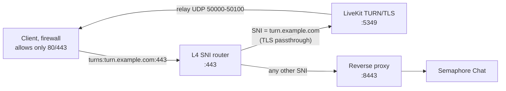

# TURN behind a reverse proxy

LiveKit ships a built-in TURN server. It gives clients behind restrictive networks a media path over TLS on port 443, so voice and video can still work when direct WebRTC traffic is blocked.

This page covers the setup that is easy to get wrong: TURN on a host where something else — Nginx Proxy Manager, Traefik, Caddy, a cloud load balancer — already owns port 443.

## Do you need this?

Voice and video try direct WebRTC first: UDP on port 7882, with TCP on 7881 as a fallback. Most networks allow this. Some do not — corporate and school firewalls, guest Wi-Fi and some mobile carriers allow little more than HTTP(S) on 80 and 443.

Symptoms when a client's network blocks WebRTC:

- a user joins a voice channel and hears nothing, and nobody hears them
- the call connects and then drops, and reconnecting fails
- it works on one network (home, phone hotspot) but not another (office, campus)

TURN relays media over TLS on 443 — traffic a firewall sees as ordinary HTTPS. If only some users are affected, you need TURN. Everyone else keeps using the direct path; TURN is only a fallback.

!!! info "LiveKit always advertises TURN on port 443"
    When TURN/TLS is enabled, LiveKit hands every client the address `turns:turn.example.com:443?transport=tcp`, no matter which port it listens on locally (`turn.tls_port`). Clients only ever dial 443. That is why TURN conflicts with a reverse proxy that terminates HTTPS on 443 — and why the fix below splits 443 by SNI instead of fighting over it.

## How it works

Two independent pieces, and both are required:

1. **SNI routing on 443.** A layer-4 router reads the TLS SNI hostname from the ClientHello, before any TLS termination. Connections for `turn.example.com` are passed through — still encrypted — to LiveKit's TURN/TLS port (`5349` by default). Everything else goes to your reverse proxy exactly as before. LiveKit terminates TURN/TLS itself.
2. **A fixed relay port range.** Once a client is authenticated over TURN/TLS, TURN relays the actual media over UDP, allocating a port per session. By default those ports are picked from a 10,000-port range (`30000`–`40000`), which no router or load balancer can forward. Pin the range, then forward it.

Skipping either step fails in a specific way: without SNI routing, clients can't reach TURN at all (signaling over 443 hits the reverse proxy and breaks); without the relay range, TURN signaling succeeds but media never flows, so a user whose UDP 7882 path is blocked still gets nothing.



## 1. Configure LiveKit

Add a `turn:` section to the LiveKit config. With Docker Compose this is the `LIVEKIT_CONFIG` environment variable; with a config file it is passed with `--config`.

```yaml title="livekit.yaml"
port: 7880
rtc:
  tcp_port: 7881
  udp_port: 7882
  use_external_ip: true
turn:
  enabled: true
  # Must match the certificate's domain. Clients are told to reach this on 443.
  domain: turn.example.com
  # LiveKit's own TURN/TLS listener. The SNI router forwards to it; clients never see it.
  tls_port: 5349
  # The SNI router passes TLS through untouched, so LiveKit terminates it.
  external_tls: false
  cert_file: /etc/livekit/turn.crt
  key_file: /etc/livekit/turn.key
  # Pin the relay range so it can be forwarded (the default is 30000-40000).
  relay_range_start: 50000
  relay_range_end: 50100
```

Notes on the fields:

| Field | Value | Why |
|-------|-------|-----|
| `domain` | `turn.example.com` | Advertised to clients and must match the TLS certificate. A wildcard certificate (`*.example.com`) works. |
| `tls_port` | `5349` | Where LiveKit listens. Clients are still told 443; the SNI router connects here. |
| `external_tls` | `false` | LiveKit terminates TLS itself, using `cert_file`/`key_file`. Set `true` only if an L4 proxy terminates TURN/TLS for you and forwards plaintext. |
| `relay_range_start` / `relay_range_end` | `50000` / `50100` | Pin the relay ports. A range of ~100 ports is plenty for a small instance; size it to your expected concurrent TURN sessions. |
| `udp_port` | unset | Enables TURN over UDP on a second port. Not needed here — restrictive networks need TURN/TLS on 443. If you set it, that UDP port must be reachable too. |

!!! tip "Certificate"
    `cert_file`/`key_file` point at a certificate valid for `turn.example.com`. A wildcard certificate for your domain is the usual choice; if the TURN hostname is on a different domain, issue one for it. In Docker, mount the files into the container (`- ./certs:/etc/livekit:ro`).

## 2. Run an SNI router on port 443

The router takes over 443 and your reverse proxy moves to another port (here `8443`). The router never decrypts anything: it reads the SNI hostname from the ClientHello and forwards the raw TCP stream.

### nginx with `ssl_preread`

The most portable option, available in the official `nginx` images and most distro packages (from the `stream` and `ngx_stream_ssl_preread_module` modules).

```nginx title="sni-router.conf"
stream {
    # Read the SNI hostname, pick a backend, forward the encrypted stream.
    map $ssl_preread_server_name $sni_upstream {
        turn.example.com  127.0.0.1:5349;   # LiveKit TURN/TLS (turn.tls_port)
        default           127.0.0.1:8443;   # your reverse proxy, moved off 443
    }

    server {
        listen 443;
        listen [::]:443;
        ssl_preread on;
        proxy_pass $sni_upstream;
        # TURN/TLS connections stay open for the length of a call.
        proxy_timeout 1h;
    }
}
```

Then have your reverse proxy (NPM, nginx, Caddy, Traefik…) listen for HTTPS on `8443` instead of `443`. Point its `turn.example.com` DNS name at the same host so the SNI router sees that SNI.

!!! note "Running the router in Docker"
    Give the router container the reverse proxy and LiveKit on a shared Docker network and use their service names, resolving them at request time with Docker's embedded DNS:

    ```nginx
    stream {
        resolver 127.0.0.11 valid=10s ipv6=off;
        map $ssl_preread_server_name $sni_upstream {
            turn.example.com  livekit:5349;
            default           reverse-proxy:8443;
        }
        server {
            listen 443;
            ssl_preread on;
            proxy_pass $sni_upstream;
            proxy_timeout 1h;
        }
    }
    ```

    ```yaml title="docker-compose.yml (fragment)"
    services:
      sni-router:
        image: nginx:latest
        restart: unless-stopped
        ports:
          - "443:443"
        volumes:
          - ./sni-router.conf:/etc/nginx/nginx.conf:ro
    ```

    The reverse proxy must stop publishing 443 (bind it to `8443` internally) so only the router owns it.

### Other proxies

- **HAProxy** — match on `req.ssl_sni` in a TCP frontend:

    ```haproxy
    frontend tls
        bind :443
        mode tcp
        tcp-request inspect-delay 5s
        tcp-request content accept if { req_ssl_hello_type 1 }
        use_backend livekit_turn if { req_ssl_sni -i turn.example.com }
        default_backend reverse_proxy

    backend livekit_turn
        mode tcp
        server livekit 127.0.0.1:5349

    backend reverse_proxy
        mode tcp
        server proxy 127.0.0.1:8443
    ```

- **Traefik** — a TCP router with `HostSNI` and TLS passthrough:

    ```yaml
    tcp:
      routers:
        turn:
          rule: "HostSNI(`turn.example.com`)"
          entryPoints: [websecure]
          service: livekit-turn
          tls:
            passthrough: true
        https:
          rule: "HostSNI(`*`)"
          entryPoints: [websecure]
          service: reverse-proxy
      services:
        livekit-turn:
          loadBalancer:
            servers:
              - address: "127.0.0.1:5349"
        reverse-proxy:
          loadBalancer:
            servers:
              - address: "127.0.0.1:8443"
    ```

    The catch-all `HostSNI(\`*\`)` router must also be a TCP router for the non-TURN traffic to keep working.

## 3. Open and forward ports

| Port | Protocol | Purpose |
|------|----------|---------|
| `443` | TCP | The only port clients use for TURN/TLS. The SNI router sends `turn.example.com` to LiveKit and everything else to the reverse proxy. |
| `5349` | TCP | LiveKit's TURN/TLS listener (`turn.tls_port`). Internal: the SNI router and LiveKit must reach each other here. Do **not** expose it publicly when the router owns 443. |
| `7881` | TCP | Direct WebRTC over TCP (fallback when UDP is blocked). |
| `7882` | UDP | Direct WebRTC media. |
| `50000`–`50100` | UDP | TURN relay media (`turn.relay_range_start`–`end`). Forward from your router/firewall to LiveKit. |

Docker Compose publishes the relay range like any other port:

```yaml title="docker-compose.yml (fragment)"
services:
  livekit:
    ports:
      - "7881:7881"                    # WebRTC over TCP
      - "7882:7882/udp"                # WebRTC media (direct)
      - "127.0.0.1:5349:5349"          # TURN/TLS: localhost only, the SNI router forwards to it
      - "50000-50100:50000-50100/udp"  # TURN relay media
```

On a home router or firewall, port-forward UDP `50000`–`50100` to the host running LiveKit as well.

## Kubernetes

On Kubernetes, the relay ports must reach the LiveKit pod through its LoadBalancer Service. A Service cannot declare a port range, so list each UDP port (`50000` through `50100`) in the LiveKit Service — the same Service that carries `7881`/`7882`, or the chart's TURN load-balancer Service.

```yaml title="livekit-relay-service.yaml (fragment)"
apiVersion: v1
kind: Service
metadata:
  name: livekit-turn-relay
spec:
  type: LoadBalancer
  selector:
    app.kubernetes.io/name: livekit-server
  ports:
    # TURN/TLS. Only needed if the SNI router targets this Service instead of a
    # host port; the relay ports below carry the media.
    - name: turn-tls
      port: 5349
      targetPort: 5349
      protocol: TCP
    # TURN relay range, one entry per port (matches turn.relay_range_start/end).
    - name: relay-50000
      port: 50000
      targetPort: 50000
      protocol: UDP
    - name: relay-50001
      port: 50001
      targetPort: 50001
      protocol: UDP
    # ... continue through 50100
```

If you deploy LiveKit with its Helm chart, add the range to the Service the chart exposes (the `turnLoadbalancer` Service fronts only `443` → `tls_port` by default) and set the same `relay_range_start`/`relay_range_end` in the LiveKit config. On a bare-metal cluster with MetalLB, the LoadBalancer IP must accept the whole UDP range; the ports are declared one by one on the Service.

## Verify

1. **LiveKit logs.** Check that TURN started with the values you set:

    ```bash
    docker compose logs livekit | grep "Starting TURN server"
    ```

    Expected (trimmed):

    ```
    Starting TURN server  turn.relay_range_start=50000 turn.relay_range_end=50100
      turn.portTLS=5349 turn.externalTLS=false
    ```

2. **ICE candidates.** Open the [Trickle ICE test page](https://webrtc.github.io/samples/src/content/peerconnection/trickle-ice/) or [icetest.info](https://icetest.info). Add `turn:turn.example.com:443?transport=tcp` with a TURN username and credential, and gather candidates. LiveKit issues TURN credentials per session, so copy them from a live call: `chrome://webrtc-internals` lists the ICE servers (with username and credential) the app's peer connection was given. From a network that only allows 80/443 you should see a `relay` candidate — that is TURN/TLS working. From an unrestricted network you'll also see `srflx`/`host` candidates.

3. **From a real call.** In `chrome://webrtc-internals` (or the app's DevTools), check the selected candidate pair of a call on the restricted network. A working TURN fallback shows a pair whose local or remote candidate is `relay` with a `turns:` / `transport=tcp` line.

4. **Simulate a blocked network.** To confirm the fallback path without a restrictive carrier, temporarily block inbound UDP 7882 and see whether the call still connects (it should fall back to TURN).

!!! tip "Nothing relayed?"
    If candidates gather but media never flows, the relay range is almost certainly not reachable. Confirm UDP `50000`–`50100` is forwarded end to end — firewall, router, and LoadBalancer — and matches `relay_range_start`/`relay_range_end` exactly. If relay candidates never appear at all, the SNI router or the TLS certificate for `turn.example.com` is the problem: verify the certificate matches the `turn.domain` and that 443 is answered by the SNI router, not the reverse proxy.

## See also

- [Connecting your LiveKit server](docker-compose.md#connecting-your-livekit-server)
- [Kubernetes — LiveKit](kubernetes.md#livekit)
- [WebSocket & LiveKit troubleshooting](../operations/websocket-troubleshooting.md)
- LiveKit: [Deploying LiveKit](https://docs.livekit.io/transport/self-hosting/deployment/) and [`config-sample.yaml`](https://github.com/livekit/livekit/blob/master/config-sample.yaml)
